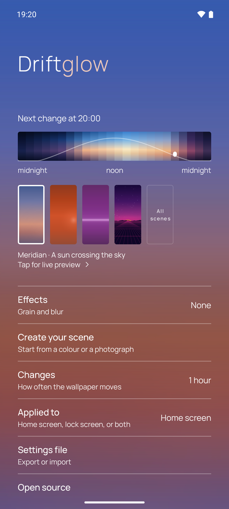
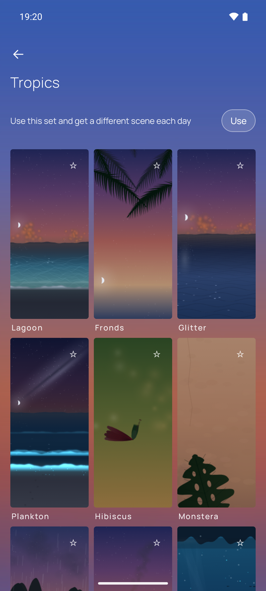
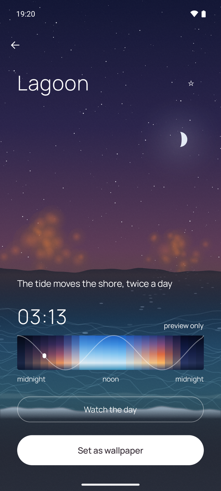
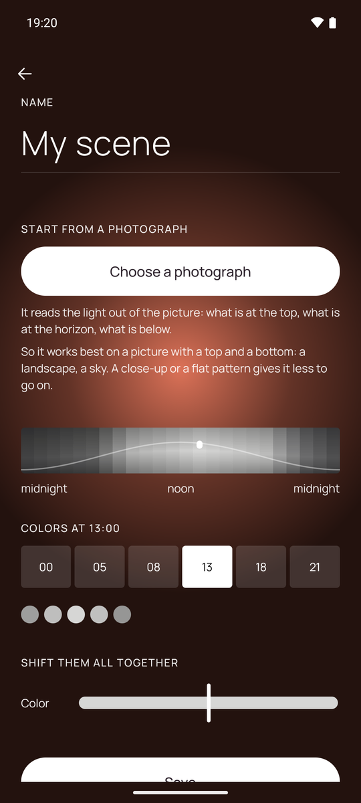

# Driftglow

A wallpaper that follows the real sun, hour by hour.

|  |  |  |  |
|:-:|:-:|:-:|:-:|
|||||
|Today's light|Ten sets of scenes, and more arriving|A whole day in a few seconds|Or build one from a photograph|

An Android app that builds your wallpaper from the time of day and changes it as
the day goes. It works out sunrise and sunset for your time zone, so a December
evening comes early and a June one does not. You can also build a scene from a
photograph of your own — the picture never leaves the phone.

A scene is not a palette: each one carries a geometry of its own, a sun crossing
an arc or a tide that moves the shore twice a day. They come in ten sets, new
ones keep arriving, and a set can rotate on its own so the wallpaper is a
different scene each day.

It has no network permission at all, and declares one permission of its own: to
set a wallpaper. Off is a real off — one switch, and it stops touching it.

### **[link009.github.io/driftglow-site](https://link009.github.io/driftglow-site/)**

- [What it does, and what it does not](https://link009.github.io/driftglow-site/)
- [Using it — five screens](https://link009.github.io/driftglow-site/how.html)
- [Privacy notice](https://link009.github.io/driftglow-site/privacy.html)

Driftglow is in closed testing on Google Play. The site says how to join.
